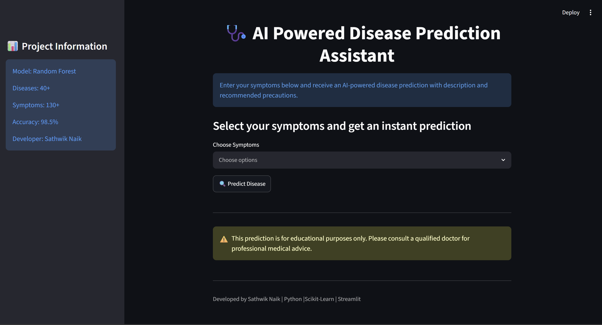
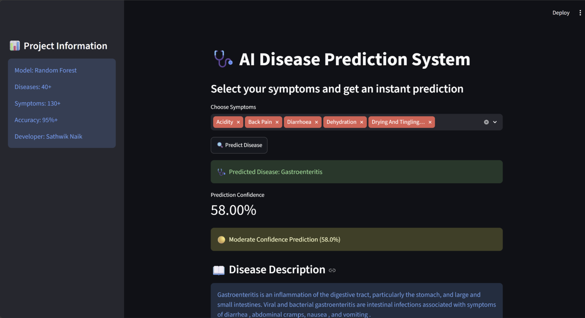
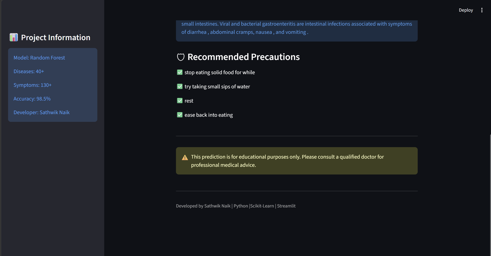

# 🩺 AI Powered Disease Prediction Assistant

An AI-powered healthcare application that predicts diseases based on user-selected symptoms using Machine Learning.

## 🚀 Features

- Disease prediction using Random Forest Classifier
- User-friendly symptom selection
- Prediction confidence score
- Disease description display
- Recommended precautions
- Interactive Streamlit web interface
- Real-time predictions

## 🛠 Tech Stack

- Python
- Pandas
- NumPy
- Scikit-Learn
- Streamlit

## 📊 Dataset

The model was trained using a healthcare symptom dataset containing:

- 130+ Symptoms
- 40+ Diseases
- Training and Testing datasets

## 📸 Screenshots

### Home Page


### Prediction Result


### Disease Information


## ⚙️ Installation

Clone the repository:

```bash
git clone https://github.com/yourusername/AI-Disease-Prediction-Assistant.git
```

Install dependencies:

```bash
pip install -r requirements.txt
```

Run the application:

```bash
streamlit run app.py
```

## 📈 Model Information

- Algorithm: Random Forest Classifier
- Symptoms: 130+
- Diseases: 40+
- Confidence-based prediction system

## 👨‍💻 Developer

Sathwik Naik

## ⚠️ Disclaimer

This project is for educational purposes only and should not be considered professional medical advice.
